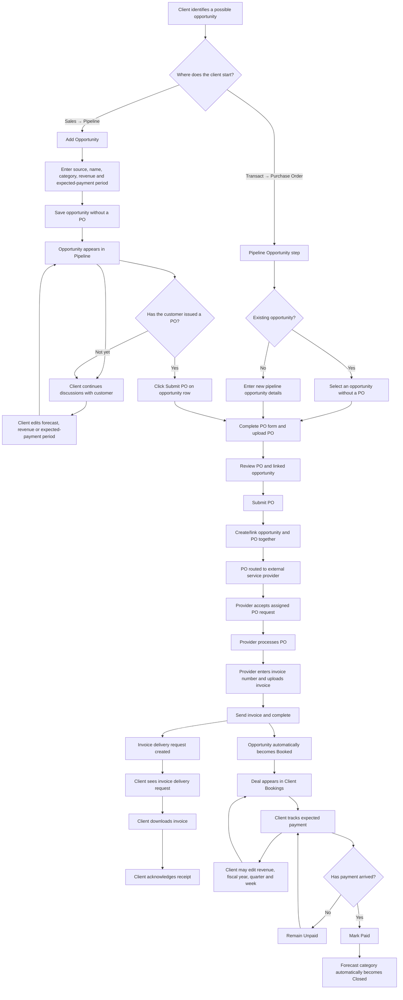

# BluBook Sales Pipeline and Bookings — User Lifecycle Handover

**Status:** Confirmed functional lifecycle

**Prepared:** 2026-08-06

**Audience:** Implementation developer
**Related plan:** `docs/SALES_PIPELINE_AND_BOOKINGS_IMPLEMENTATION_PLAN.md`

## 1. Feature outcome

Create a top-level **Sales** navigation area for client users:

```text
Sales
├── Pipeline
└── Bookings
```

The Pipeline lets a client record and maintain possible sales opportunities before a customer has issued a purchase order. A PO is optional for a pipeline opportunity. Every submitted PO, however, must be linked to exactly one pipeline opportunity.

The Bookings view is client-only and contains opportunities whose linked PO request has been completed. Pipeline and Bookings are two views over the same opportunity record, not duplicate tables.

## 2. Actors and access

| Actor | Access |
| --- | --- |
| Client | Sees Sales → Pipeline and Bookings; creates and edits opportunities; submits POs; downloads and acknowledges invoices; maintains booking revenue, payment status, and expected-payment period |
| External service provider | Does not see Pipeline or Bookings; processes assigned PO requests; enters invoice number; uploads and sends invoice; may use a narrow Paid/Unpaid action on its linked request detail |
| Internal sales staff | No Pipeline or Bookings access for this feature |
| Logistics | No workflow is included in this tranche |

“Sales provider” in the product discussion means the external `service_provider` user type, not an internal user with `staff_role = sales`.

## 3. Relationship rules

```text
Pipeline opportunity → zero or one PO
PO request           → exactly one pipeline opportunity
```

- An opportunity can remain without a PO indefinitely while the client is talking to a prospective customer.
- A client can create, save, and edit an opportunity without entering the PO flow.
- An opportunity can have no more than one PO.
- A PO cannot be submitted without selecting or creating its opportunity.
- The database relationship uses the opportunity’s immutable internal UUID, not its visible Deal ID, name, revenue, or other editable values.
- Editing an opportunity later does not break its PO relationship.

Recommended database relationship:

```text
service_requests.sales_opportunity_id → sales_opportunities.id
```

Enforce the one-PO-per-opportunity rule at the database boundary with an appropriate unique constraint/index for `purchase_order` requests.

## 4. Full lifecycle



## 5. Stage 1 — Create and maintain an opportunity

The client navigates to:

```text
Sales → Pipeline → Add Opportunity
```

Required business fields:

| Field | Behaviour |
| --- | --- |
| Opportunity Source | Client-editable; initial examples are Team and Web |
| Deal ID | System generated and immutable; proposed format `BLB-YYYY-NNNNNN` |
| Opportunity Name | Client-editable |
| Forecast Category | Client-editable controlled value |
| Revenue | Client-editable ZAR amount |
| Fiscal Year | Client-editable reporting year |
| Fiscal Quarter | Client-editable value 1–4 |
| Fiscal Week | Client-editable quarter-relative value 1–13 |

Saving this form immediately creates the Pipeline record. The client is not required to submit a PO.

Before any completed PO exists, the client can edit the opportunity, continue customer discussions, submit a PO later, or delete the opportunity.

## 6. Stage 2A — Submit a PO from Pipeline

Each eligible opportunity row has one **Submit PO** action in its Actions column.

Suggested row-action states:

| State | Action |
| --- | --- |
| No PO linked | **Submit PO** |
| PO submitted | **View PO** |
| Provider processing | **View PO · In progress** |
| PO completed | **View PO · Booked** |

Clicking **Submit PO** opens the existing PO flow with the opportunity already selected and locked. Display a confirmation summary containing:

- Deal ID;
- opportunity name;
- revenue; and
- fiscal year, quarter, and week.

The client then completes the existing PO details and uploads the PO document.

## 7. Stage 2B — Submit a PO through the regular channel

When the client navigates through:

```text
Transact → Purchase Order
```

the flow starts with a required **Pipeline Opportunity** step.

The client chooses one of two paths:

### Select an existing opportunity

Only show opportunities that:

- belong to the current client;
- do not already have a PO; and
- have not been deleted.

### Create a new opportunity

Collect the same Pipeline business fields listed in Stage 1. The client then proceeds to the PO details/upload step.

On final submission, the opportunity and PO request are created and linked atomically. If validation, upload, or persistence fails, neither record should remain. Abandoning an intermediate step must not create an empty Pipeline record.

## 8. Stage 3 — External provider processing and invoice return

The submitted PO follows the existing service-request routing and assignment flow.

The external provider:

1. accepts the assigned PO request;
2. starts and processes the request;
3. enters the invoice number;
4. uploads the invoice document; and
5. selects **Send invoice and complete**.

For a linked PO, replace or guard the generic **Complete** action. The provider must not be able to complete the PO without the required invoice number and invoice document.

The provider sees the assigned request and minimal linked-deal context, but never receives Sales navigation or direct access to Pipeline/Bookings data.

## 9. Stage 4 — Atomic booking and invoice delivery

**Send invoice and complete** must perform one transactional/idempotent operation:

1. validate that the caller owns the accepted PO assignment;
2. validate the PO is linked to exactly one opportunity;
3. store the invoice number against that opportunity;
4. persist the invoice document;
5. create a client-facing `document_delivery` request related to the source PO;
6. complete the original PO request;
7. set the opportunity forecast category to `Booked`;
8. set permanent `booked_at`; and
9. append audit events containing the source PO and invoice-delivery request IDs.

The existing `document_delivery` mechanism should be reused. It already provides client download and acknowledgement behaviour. Do not create a logistics handover flow.

If any part fails, the PO must not be completed and no partial booking/delivery should remain.

## 10. Stage 5 — Client invoice receipt and acknowledgement

The client receives an invoice delivery request similar to:

```text
Invoice for BLB-2026-000023
Invoice number: BD 8896

[Download invoice] [Acknowledge receipt]
```

Acknowledgement means only that the client received the invoice. It must not change Paid/Unpaid.

## 11. Stage 6 — Bookings tracking

Bookings membership is based strictly on a permanent completed linked PO / `booked_at`, not the current forecast-category text.

| Field | Client access | External provider access |
| --- | --- | --- |
| Deal ID | View | No table access |
| Opportunity Name | View | No table access |
| Invoice Number | View only | Enter through assigned PO request |
| Revenue | Edit | None |
| Paid/Unpaid | Edit | Narrow action through linked request detail only |
| Fiscal Year | Edit | None |
| Fiscal Quarter | Edit | None |
| Fiscal Week | Edit | None |

Revenue and expected-payment fields are the same columns shown in Pipeline. Updates in either client view therefore remain synchronized without copying records.

## 12. Stage 7 — Payment

Until payment arrives, the booking remains `Unpaid`.

When payment arrives:

- the client can mark Paid from Bookings;
- the assigned provider can use a narrow payment action on the linked request detail without table access;
- `paid_at` is recorded; and
- the forecast category automatically changes to `Closed`; and
- both changes are appended to the audit history.

If an authorized user later changes Paid back to Unpaid, the system records the reversal but does not automatically change `Closed` back to an earlier forecast category. Any category correction must be a separate explicit, audited edit.

Invoice acknowledgement and payment are separate events.

## 13. Forecast-category definitions

| Category | Meaning |
| --- | --- |
| Open | Definition still required |
| Upside | Realistic chance of closing in the current quarter |
| Best Case | Moderately confident opportunity that could close if things go perfectly |
| Commit | Highly confident deal (80–90%+ close rate), contracts in final stages, no major risks remain |
| Booked | Corrected definition: work on the linked PO submission has completed |
| Closed | Money is in the bank |

The corrected Booked definition supersedes the older workbook wording “Shipped and Invoiced.”

## 14. Permanent invariants

- A Pipeline opportunity can exist without a PO.
- Every PO must have exactly one opportunity.
- An opportunity can have no more than one PO.
- Only a completed linked PO creates permanent booking eligibility.
- Manually selecting `Booked` without a completed linked PO does not place the deal in Bookings.
- Changing the category after PO completion does not remove the deal from Bookings.
- A deal that has ever had a completed linked PO cannot be deleted, even if its category later changes.
- The external provider cannot query or browse Pipeline or Bookings.
- Invoice delivery acknowledgement does not mark the booking Paid.
- Opportunity revenue is not silently overwritten by the PO or invoice amount.
- No logistics workflow is included.

## 15. Remaining product decisions

1. Confirm the definition of `Open` and the intended ordering between Upside and Best Case.
2. Confirm the initial payment status when the PO completes. Recommended: `Unpaid`.
3. Confirm invoice-number uniqueness. Recommended: case-insensitive uniqueness per client, ignoring blank values.
4. Confirm whether revenue is VAT-inclusive or VAT-exclusive.
